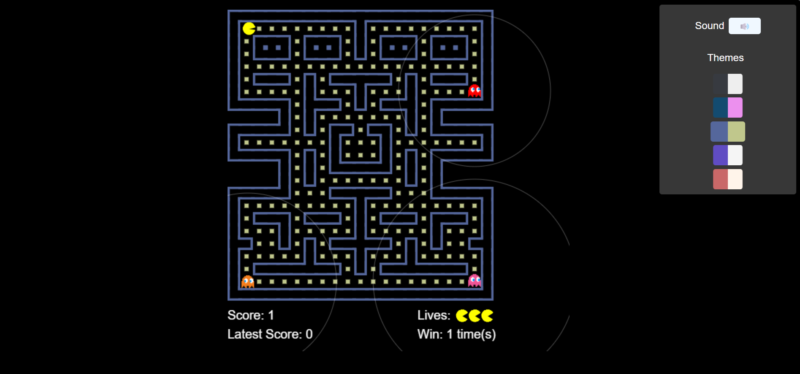
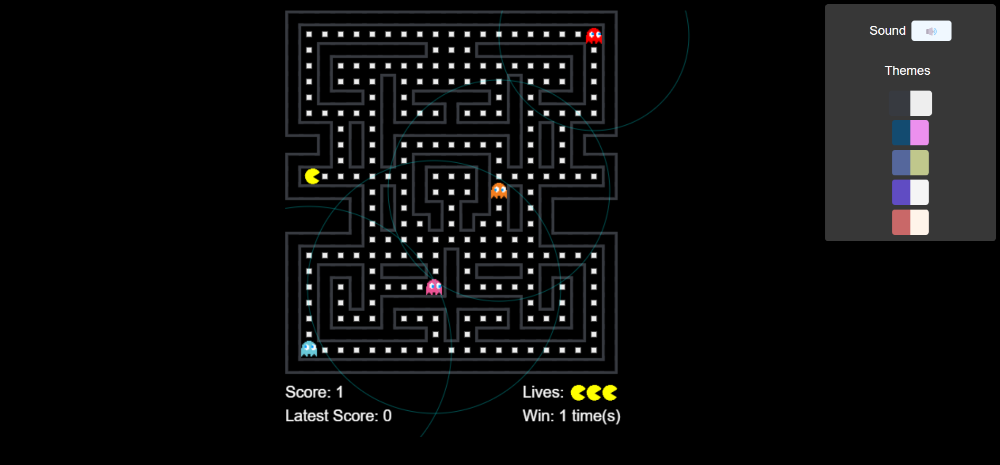

# Pacman JS

 

Web-based Pacman Game Using Javascript.

## Preview

    
    

### Maps Generator

This game uses some maps to play on and those are generated using the tool [Pac-man Maze Generation](https://shaunlebron.github.io/pacman-mazegen/) created by [shaunlebron](https://github.com/shaunlebron).

### How to Play?

These are some brief instructions to play the game:

- Press `Space` key to play/pause the game.
- Press Up `🔼`, Right `▶`, Bottom `🔽`, and Left `◀` arrow keys to controller the Pacman.
- Click the sound button `🔊` to turn on the backsound audio.
- Alternatively, press `M` key to mute/unmute the backsound audio if the backsound already ever played in the current session.
- You can also choose the themes you like by clicking one of them to apply.
